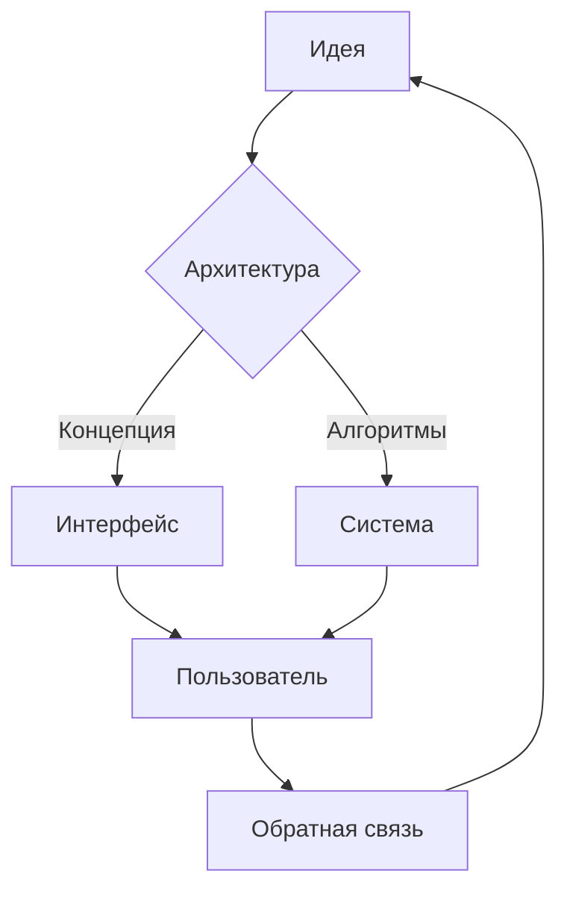

# 🧬 Baubaffi: нейрокод в стиле будущего

> **"Если систему можно представить — её уже можно спроектировать."**
>
> — credo архитектурного мышления


## 📜 О чём это

`Baubaffi` — это не просто репозиторий. Это среда, где идеи проходят через сетку алгоритмов и превращаются в архитектуры, будто их оставили нам пришельцы.

- ⚡ Превращаю концепции в продукты
- 🛠️ Строю архитектуру, которая не ломается от первого же ветра
- 🌌 Думаю в категориях систем, а не файлов

<div align="center">
  <sub>Если ты читаешь это — ты уже сдвинулся во времени вперёд.</sub>
</div>

---

## 🧭 Навигация

- [Чем я занимаюсь](#-чем-я-занимаюсь)
- [Стек и инструменты](#-стек-и-инструменты)
- [Принципы](#-принципы)
- [Проекты](#-проекты)
- [Манифест](#-манифест)
- [Контакт](#-контакт)

---

## 🚀 Чем я занимаюсь

| Сфера | Что происходит | Результат |
|-------|----------------|-----------|
| 🧠 Стратегия | Проектирую экосистемы взаимодействия | Цельная логика продукта |
| 🧩 Интерфейсы | Перевожу мысли в UX-паттерны | Экран — как космический прибор |
| 🤖 Алгоритмы | Создаю структуры, которые учатся и адаптируются | Системы, которые живут своей жизнью |

---

## 🛠️ Стек и инструменты

```text
🌐 Web:        Next.js • Astro • Tailwind • Framer Motion
⚙️ Backend:    Node.js • FastAPI • GraphQL • Supabase
🧪 R&D:        Python • Jupyter • LangChain • OpenAI API
📡 Ops:        Docker • Fly.io • GitHub Actions • Railway
🎨 Design:     Figma • Pen & Paper • Midjourney Prompts
```

> Всё это — только инструменты. Главное — сценарий, который они оживляют.

---

## 🧬 Принципы

1. **Мышление системой.** Каждый модуль — часть целой экосистемы.
2. **Прозрачная сложность.** Архитектура может быть глубокой, но не должна быть мутной.
3. **Интерфейс как манифест.** UI — это язык проекта. Его грамматика важна.
4. **Автоматизация всего.** То, что можно делегировать машинам — делегирую.

---

## 📈 Проекты

- **Neuro Scaffolder** — генератор архитектурных каркасов, который подстраивается под идею.
- **Fractal UI Lab** — набор интерфейсных паттернов, чтобы собрать продукт за ночь.
- **Adaptive Ops** — пайплайны, где деплой происходит быстрее, чем ты успеваешь моргнуть.

---

## 🛡️ Манифест



> Цикл бесконечен. Улучшение — неизбежно.

---

## 📬 Контакт

Хочешь строить будущее, которое ещё не запротоколено? Пиши:

- **Telegram:** [@baubaffi](https://t.me/baubaffi)
- **Email:** [hello@baubaffi.dev](mailto:hello@baubaffi.dev)

**Добро пожаловать в реальность, где код — это интерфейс к идеям.**
